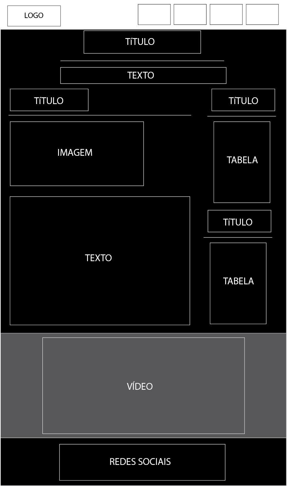
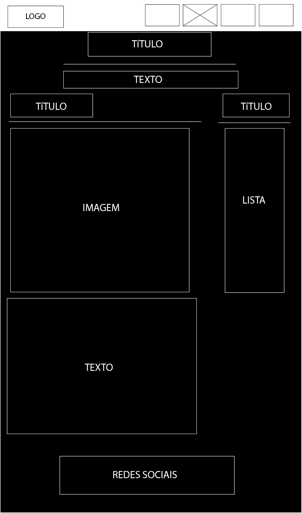
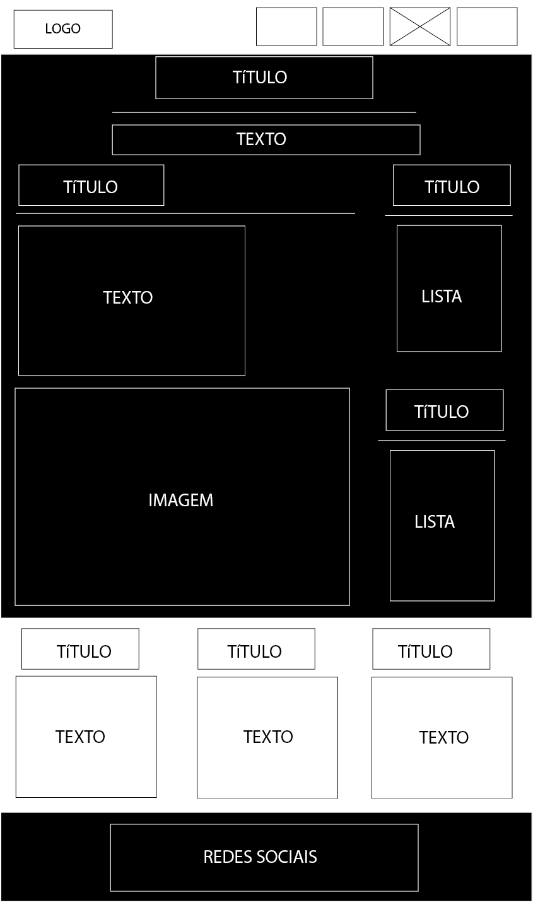
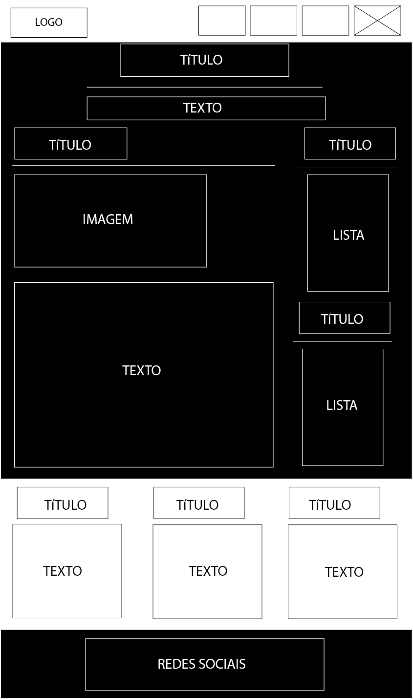
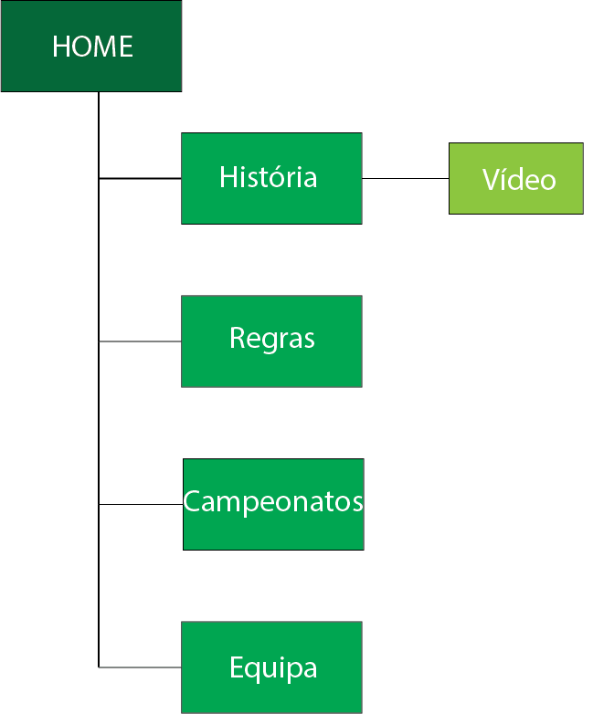

# Relatorio

## 1 Apresentação do projeto 

O nosso trabalho tem como objetivo principal dar a conhecer dar a conhecer a historia da NBA, as suas regras, os campeonatos e a equipa, os Golden State Warriors.

## Interface com o utilizador

## Produto

### Descrição do produto

Em relação ao nosso primeiro tópico apresentamos o passado da criação desta liga de basketball, destacando assim as equipas que existem dividindo-as nas suas respetivas conferências ( conferencia leste e conferencia oeste), ressaltando também as diferentes lendas que constituíram esta liga.

Posteriormente, com o intuito de demonstrar as regras que fazem propriamente parte do desporto basketball, como também aquelas que só estão em vigor na NBA. Dando então crucial relevância à diferença entre a FIBA (Federação Internacional de Basquetebol)  e a NBA.

De seguida, enfatizando diversos tópicos relativamente aos prêmios, abordamos: os campeonatos, os MVPs( Most Valuable Player Award), o rookie of the year, o defensive player of the year, most improved player e o coach of the year.

Por último, de modo a mostrar a importância da equipa Golden State Warriors, decidimos expor a sua historia, o seu plantel, as suas lendas, os números retirados, os recordes e os seus títulos de campeões.

Assim sendo, o proposito deste projeto passa pela divulgação da informação dos tópicos mencionados anteriormente através da elaboração de um web site dinâmico e cativador para o leitor.

### Instruções de instalação e configuração

Não é necessário qualquer tipo de instalação no nosso web site

### Regras de utilização

Não é exigida nenhuma autentificação, qualquer utilizador apenas tem que ter acesso à internet e não tem qualquer tipo de restrição 
 
### Ajuda à navegação

O nosso site tem os menus e todos elementos separados com um grande destaque de cor e com o espaçamento necessário entre eles

### Validações de formulários

### Validação do HTML e CSS

### Detalhes de implementação

